kotlin上手
=====

本文介绍了kotlin的安装，简单kotlin工程的创建，以及第一个kotlin示例代码。

# 一、安装
kotlin内嵌在IDEA里，直接安装IDEA即可。

当前时间点(2022/10)，本地安装了`ideaIC-2022.2.3`，即`IDEA 2022.2.3 社区版`，其自带的kotlin版本是`1.7.10`。

# 二、kotlin工程

## 2.1 创建kotlin工程
创建一个单纯的kotlin-java工程：

在IDEA中操作：
```
File -> New Project...
```

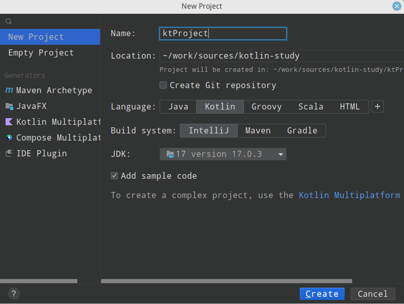

选择左侧的`New Project`，右侧填入以下信息:
- Name : 工程名
- Location: 工程父目录
- Language: 语言，选择`Kotlin`
- Build system: 编译系统，这里先选择`IntelliJ`，以后实际开发时会使用`Maven`或`Gradle`
- JDK: 选择JDK版本，这里选择的是本地已经安装好的openJDK17

然后点击`Create`就会生成一个kotlin工程，打开它：

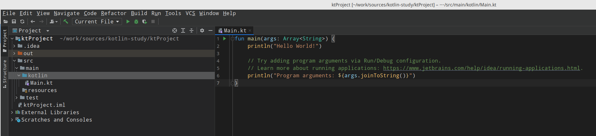

因为刚刚在创建工程的页面选择了`Add sample code`，所以这里已经为我们生成了示例代码`Main.kt`。

## 2.2 检查kotlin工程
打开这个工程的`Project Structrue`，检查其工程配置。

`Project`选项卡：

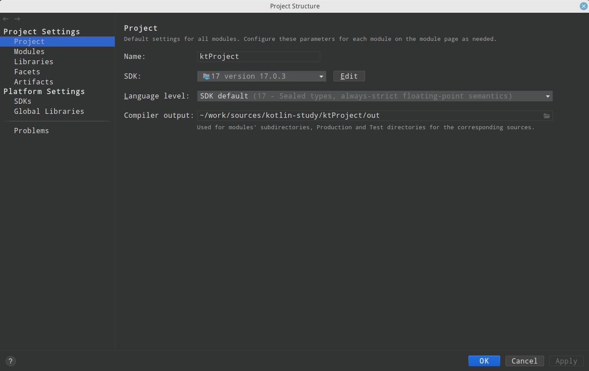

注意，工程使用的SDK就是创建时指定的Java的JDK17，语言级别则是对应的java17。

`Modules`选项卡中的`Sources`：

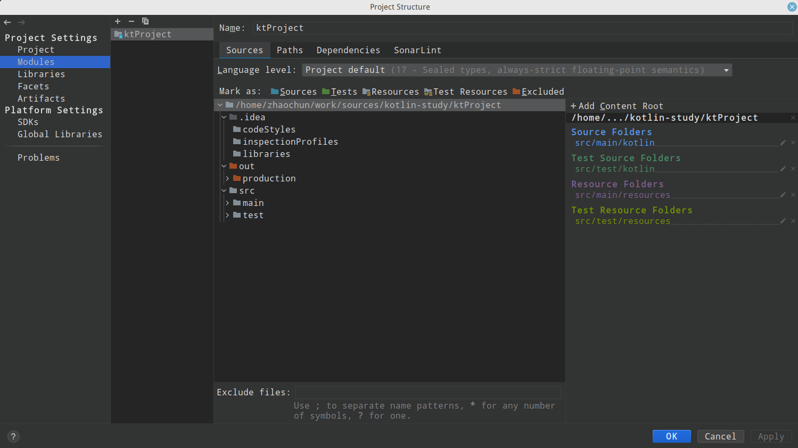

语言级别也是java17，工程的`Sources`、`Resources`等根目录与普通Java工程是一样的，只是把java工程中的`java`目录换成了`kotlin`目录。这些都是编译对象目录。

`Modules`选项卡中的`Dependences`：

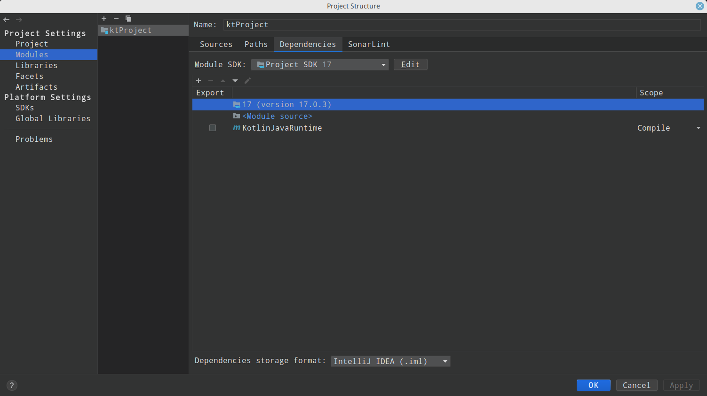

这里只依赖了jdk17和`KotlinJavaRuntime`。

`Libraries`选项卡：

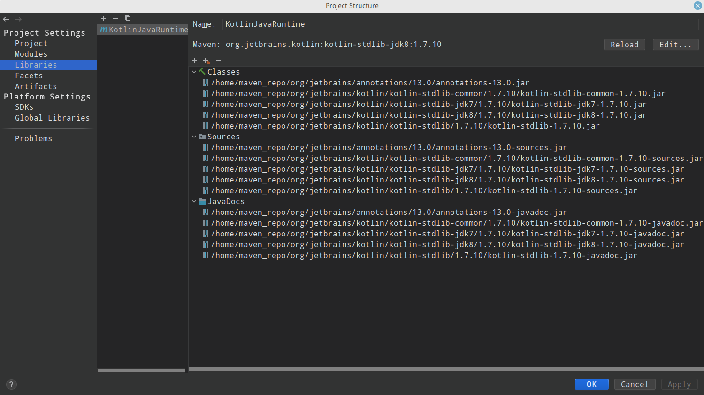

这里的`KotlinJavaRuntime`是IDEA自带的，现在默认版本是`1.7.10`，可以通过`Edit`改为下载最新的`1.7.20`:

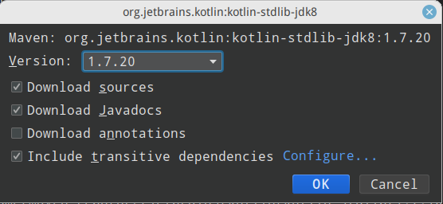

然后`KotlinJavaRuntime`就换成了最新的版本:

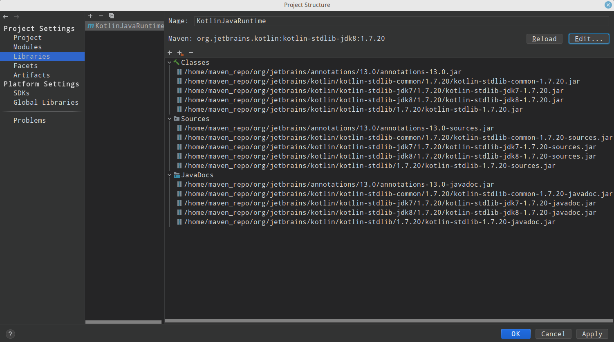

点击`apply`，然后关闭`Project Structrue`，查看左侧`project`窗口中的`External Libraries`：

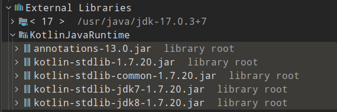

可以看到目前工程的依赖有jdk17和KotlinJavaRuntime的`1.7.20`版本的相关依赖包。

# 三、kotlin示例代码
刚才创建的kotlin工程已经有了一个示例代码`Main.kt`，直接运行可以看到结果:
```
Hello World!
Program arguments: 

```


这里我们再自己创建一个新的kotlin源代码文件，并运行它。

先在`src/main/kotlin`目录下创建一个`Package`，这里创建的是`com.czhao.study`。

然后在`com.czhao.study`上右键选择`New -> Kotlin class/file`:

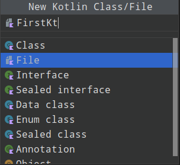

这里创建一个名为`FirstKt`的File，注意要选择`File`。

然后在`FirstKt.kt`里输入以下代码:

```kotlin
package com.czhao.study

fun main() {
    println("Hello FirstKt!")
}
```

右键运行，得到:
```
Hello FirstKt!
```

修改main函数：
```kotlin
fun main(args: Array<String>) {
    println("Hello FirstKt!")
    println("args:" + args.contentToString())
}
```
并配置启动参数(`右键 -> Modify Run Configuration...`)：

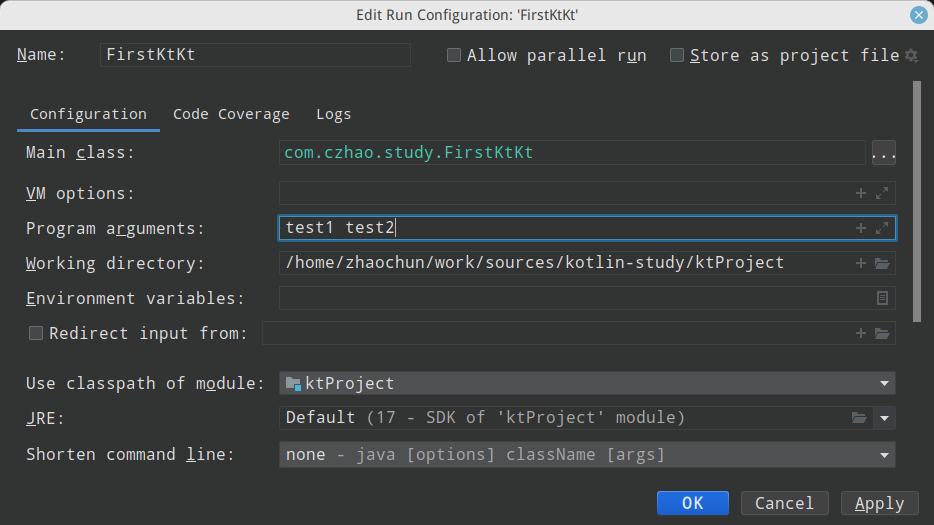

再次运行得到：
```
Hello FirstKt!
args:[test1, test2]
```

